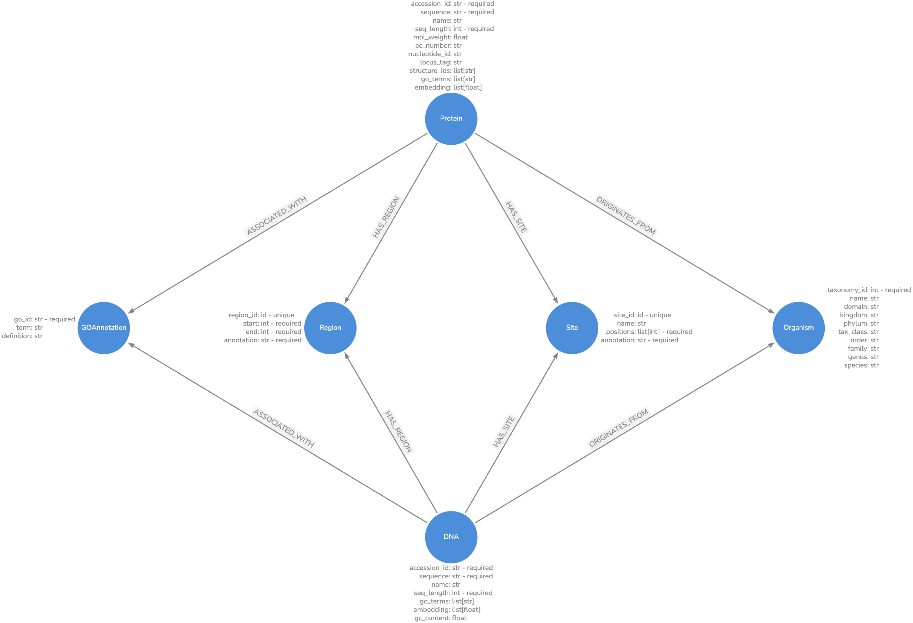

<div align="center">
<h1 align="center">PyEED

</div>

[](https://github.com/PyEED/pyeed/actions/workflows/tests.yaml)
[](https://github.com/PyEED/pyeed/actions/workflows/make_docs.yaml)

## About 📖
pyeed is a toolkit enabling object-oriented analysis of protein sequences, instead of working with sequences in a file-oriented fashion. This will enable the user to easily access and manipulate sequence information and to perform analyses on the sequence data.  
This library is currently under development and thus the API is subject to change.




## Installation ⚙️

Install `pyeed` by running
```bash
pip install git+https://github.com/PyEED/pyeed.git
```

## Features

- Supports various protein language models including ESM2, ESMC, ESM3, ProtT5,
  and the newly integrated [SaProt](https://huggingface.co/westlake-repl/SaProt_650M_AF2).

## SaProt mutation prediction

PyEED exposes utilities from SaProt for estimating mutation effects. Example:

```python
from pyeed.embeddings.models import SaProtFoldseekMutationModel

model = SaProtFoldseekMutationModel()
model.to("cuda")
model.eval()

seq = "M#EvVpQpL#VyQdYaKv"  # '#' marks low-confidence regions
score = model.predict_mut(seq, "V3A")
print(score)
```

By default, the weights are downloaded from Hugging Face. Set
``config_path`` if you wish to load a local model directory.
