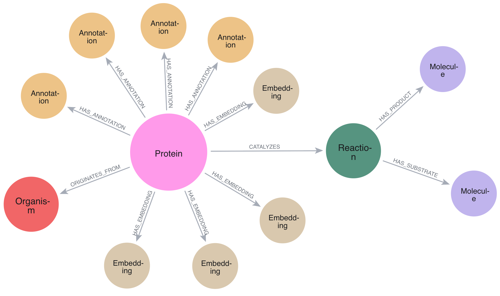

<div align="center">
<h1 align="center">pyeed</h2>
<h2 align="center" >Python Enzyme Engineering Database</h2>
</div>


## About 📖
`pyeed` is a library for creating custom Sequence Databases from primary databases such as UniProt. pyeed provides an extensible data model, structuring information on sequences, annotations and their embeddings.



## Installation ⚙️

Install `pyeed` by running
```bash
pip install git+https://github.com/PyEED/pyeed.git
```

## Usage 🚀

### Configure Neo4j Database
pyeed provides a `Database` class for interacting with a Neo4j database.
It automatically loads the database credentials from the environment variables `NEO4J_URI`, `NEO4J_USER`, and `NEO4J_PASSWORD`.
```
NEO4J_URI="bolt://localhost:7687"
NEO4J_USER="neo4j"
NEO4J_PASSWORD="12345678"
```

### Ingest UniProt Data
Use `ingest_uniprot` to fetch and store proteins by accession IDs.

```python
import asyncio
from pyeed import ingest_uniprot, Database
from pyeed.model import MODEL_CLASSES  # schema sync

async def main():
    db = Database()
    db.verify_connection()
    await db.sync_schema(MODEL_CLASSES)

    accessions = ["P04182", "Q6QDP7", "P04182"]
    await ingest_uniprot(db, accessions)

asyncio.run(main())
```

### Add Custom Data
Besides ingesting data from UniProt, it is also possible to add custom data to the database. There are three main entry points:

#### 1. Add a single Protein and its subtree
Use `.save()` to insert one root object (e.g. a Protein) together with all its nested children (organisms, annotations, reactions, embeddings...).

```python
import asyncio
from pyeed import (
    Database, Protein, Organism, Annotation, AnnotationType, Reaction, Molecule, Embedding
)

async def main():
    db = Database()
    db.verify_connection()

    # Create a Protein object
    p1 = Protein(
        accession_id="P00001",
        name="Protein 1",
        sequence="ACDEFGHIKLMNPQRSTVWY",
    )
    
    # Add organisms
    p1.organisms.append(Organism(tax_id=9606, name="Homo sapiens"))

    # Add annotations
    p1.annotations.append(
        Annotation(annotation_type=AnnotationType.ACTIVE_SITE, positions=[10, 11, 12])
    )

    # Add reactions
    reaction = Reaction(rhea_id="RHEA:000001")
    reaction.substrates.append(Molecule(chebi_id="CHEBI:15377", name="H2O"))
    reaction.products.append(Molecule(chebi_id="CHEBI:2364", name="H+"))
    p1.reactions.append(reaction)

    # Add embeddings
    emb = Embedding(
        model_name="esm2_t33_650m",
        pooling_method="mean",
        n_dims=3,
        vector=[0.1, 0.2, 0.3],
    )
    p1.embeddings.append(emb)

    # Save the Protein object together with its subtree
    await db.save(p1)

asyncio.run(main())

```

#### 2. Add multiple Protein nodes at once
Use `.save_many()` to insert multiple root objects (e.g. Proteins) together with all their nested children (organisms, annotations, reactions, embeddings…).

```python
import asyncio
from pyeed import Database, Protein

async def main():
    db = Database()
    db.verify_connection()

    p2 = Protein(accession_id="TEST_P00002", sequence="ACDEFGHIKLMNPQR", name="P2")
    p3 = Protein(accession_id="TEST_P00003", sequence="ACDEFGHIKLMNPQR", name="P3")

    await db.save_many([p2, p3])

asyncio.run(main())
```

#### 3. Attach Annotations, Embeddings, etc. to an existing Protein
Use `.attach()` to add annotations, embeddings, etc. to an existing Protein.

```python
import asyncio
from pyeed import Database, Protein, Embedding, Annotation, AnnotationType

async def main():
    db = Database()
    db.verify_connection()

    accession_to_attach = "P00003"
    embedding = Embedding(
        model_name="esm2_t33_650m",
        pooling_method="mean",
        n_dims=3,
        vector=[0.1, 0.2, 0.3],
    )
    annotation = Annotation(
        annotation_type=AnnotationType.ACTIVE_SITE,
        positions=[10, 11, 12],
    )

    await db.attach(
        parent=Protein,
        parents_to_children={accession_to_attach: [embedding, annotation]},
    )

asyncio.run(main())
```

### Query the Database
Cypher queries can be executed against the connected Neo4j database using the `query` method:

```python
from pyeed import Database

db = Database()
q_res = db.query("MATCH (p:Protein) RETURN p.accession_id AS AC_ID")
print(q_res)
```

### Calculate Sequence Embeddings

...