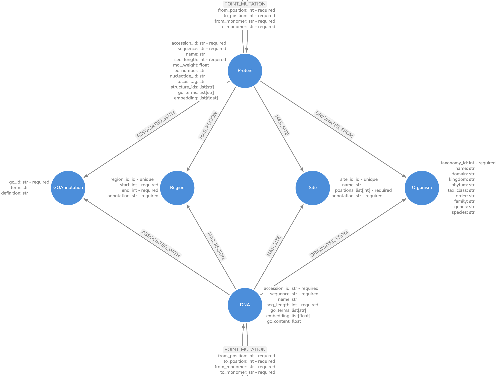

<div align="center">
<h1 align="center">PyEED

</div>

[](https://github.com/PyEED/pyeed/actions/workflows/tests.yaml)
[](https://github.com/PyEED/pyeed/actions/workflows/make_docs.yaml)

## About 📖
pyeed is a toolkit enabling object-oriented analysis of protein sequences, instead of working with sequences in a file-oriented fashion. This will enable the user to easily access and manipulate sequence information and to perform analyses on the sequence data.  
This library is currently under development and thus the API is subject to change.




## Installation ⚙️

Install `pyeed` by running
```bash
pip install git+https://github.com/PyEED/pyeed.git
```

## Quick start 🚀

### Launch Neo4j database via Docker and mount to a local directory
