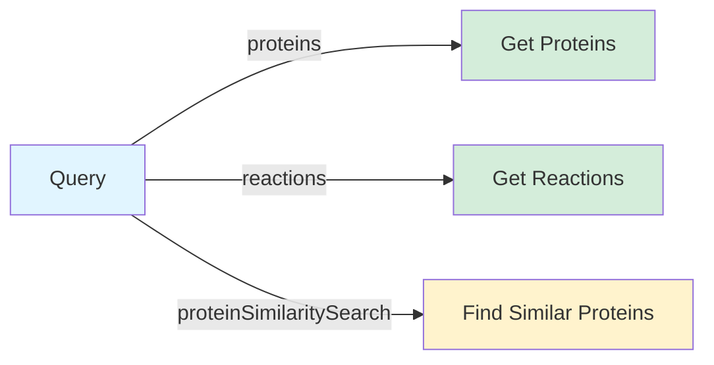
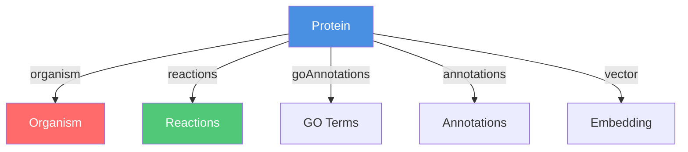
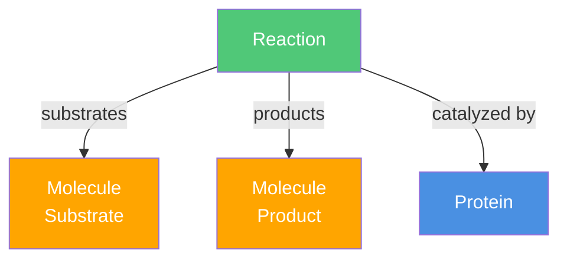

# GraphQL API

Query protein sequences, reactions, and their relationships through a GraphQL API.

[Try the GraphQL Playground :material-play:](http://localhost:8123/graphql){ .md-button .md-button--primary }

!!! tip "Endpoint"

    The GraphQL endpoint is available at `http://localhost:8123/graphql`. Start the server with:
    
    ```bash
    python -m pyeed.graphql.app
    ```

## What You Can Query

The API provides three main queries:



### Proteins

Fetch proteins by ID or filter by properties.

**By ID:**
```graphql
query {
  proteins(ids: ["P12345", "P0CW62"]) {
    id
    name
    seqLength
    sequence
  }
}
```

**By Filter:**
```graphql
query {
  proteins(
    filter: {
      seqLengthMin: 100
      seqLengthMax: 500
      ecNumbers: ["1.1.1.1"]
    }
  ) {
    id
    name
    seqLength
    ecNumbers
  }
}
```

**Available Filters:**
- `id`, `name`, `sequence` - Exact match
- `seqLengthMin`, `seqLengthMax` - Range filter
- `molWeightMin`, `molWeightMax` - Range filter
- `ecNumbers` - Array of EC numbers

### Reactions

Fetch reactions by ID or filter by properties.

```graphql
query {
  reactions(
    ids: ["RHEA:12345"]
    filter: { reversible: true }
  ) {
    id
    description
    reversible
    substrates {
      id
      name
      smiles
    }
    products {
      id
      name
    }
  }
}
```

### Similarity Search

Find proteins similar to a given protein using vector embeddings.

```graphql
query {
  proteinSimilaritySearch(
    ids: "P12345"
    limit: 10
  ) {
    id
    name
    seqLength
  }
}
```

## Relationships

Query related data by following relationships in your queries.

### Protein Relationships



**Get protein with organism:**
```graphql
query {
  proteins(ids: ["P12345"]) {
    id
    name
    organism {
      id
      scientificName
      commonName
    }
  }
}
```

**Get protein with reactions:**
```graphql
query {
  proteins(ids: ["P12345"]) {
    id
    name
    reactions {
      id
      description
      reversible
    }
  }
}
```

**Get protein with annotations:**
```graphql
query {
  proteins(ids: ["P12345"]) {
    id
    name
    goAnnotations {
      id
      term
      definition
    }
    annotations {
      id
      positions
      description
    }
  }
}
```

### Reaction Relationships



**Get reaction with substrates, products, and catalyzing proteins:**
```graphql
query {
  reactions(ids: ["RHEA:12345"]) {
    id
    description
    substrates {
      id
      name
      smiles
    }
    products {
      id
      name
      smiles
    }
    catalyzingProteins {
      id
      name
      ecNumbers
    }
  }
}
```

## Complete Examples

### Example 1: Full Protein Details

```graphql
query {
  proteins(ids: ["P12345"]) {
    id
    name
    sequence
    seqLength
    molWeight
    ecNumbers
    organism {
      id
      scientificName
      commonName
    }
    reactions {
      id
      description
      reversible
    }
    goAnnotations {
      id
      term
      definition
    }
  }
}
```

### Example 2: Find Proteins by EC Number

```graphql
query {
  proteins(
    filter: {
      ecNumbers: ["1.1.1.1"]
      seqLengthMin: 200
    }
  ) {
    id
    name
    seqLength
    ecNumbers
    organism {
      scientificName
    }
  }
}
```

### Example 3: Find Similar Proteins

```graphql
query {
  proteinSimilaritySearch(
    ids: "P12345"
    limit: 5
  ) {
    id
    name
    seqLength
    organism {
      scientificName
    }
  }
}
```

## Available Fields

### Protein Fields

- `id` - Protein identifier
- `name` - Protein name
- `sequence` - Amino acid sequence
- `seqLength` - Sequence length
- `molWeight` - Molecular weight
- `ecNumbers` - Enzyme Commission numbers
- `vector` - Embedding vector (list of floats)
- `organism` - Organism (Taxon)
- `reactions` - Reactions catalyzed by this protein
- `goAnnotations` - Gene Ontology annotations
- `annotations` - Sequence annotations

### Reaction Fields

- `id` - Reaction identifier
- `description` - Reaction description
- `reversible` - Whether reaction is reversible
- `substrates` - Substrate molecules
- `products` - Product molecules
- `catalyzingProteins` - Proteins that catalyze this reaction

### Molecule Fields

- `id` - Molecule identifier
- `name` - Molecule name
- `smiles` - SMILES notation
- `inchi` - InChI identifier

### Taxon Fields

- `id` - Taxonomy ID
- `scientificName` - Scientific name
- `commonName` - Common name
- `rank` - Taxonomic rank
