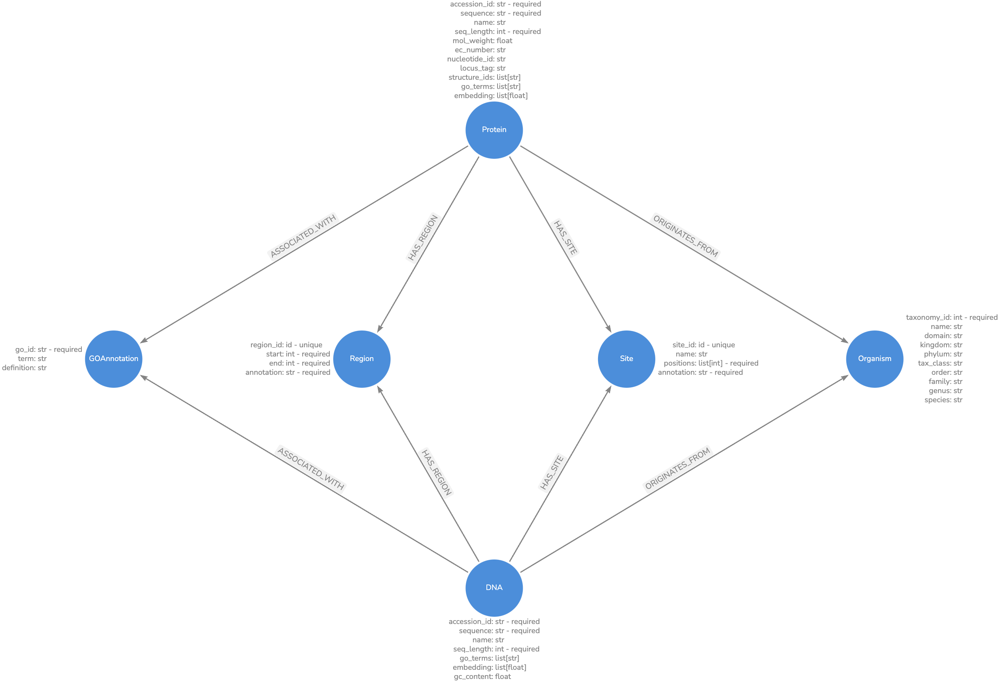

# Python Enzyme Engineering Database

!!! warning "API under construction 🏗️"

    The API is currently under construction and is subject to change.

## 🤔 What is pyeed?

`pyeed` is a Python toolkit, for creation of Protein and or Nucleotide knowledgegraphs for bioinformatic analysis. The knowledge graph is based on the pyeed graph model, structuring Protein and Nucleotide sequences, annotations, and metadata in a Neo4j graph database. pyeed enables seamless data integration ov various bioinformatic data sources, such as Uniprot and NCBI. Besides the graph model pyeed provides a set of tools for sequence analysis, such as sequence alignment, or calculation of sequence embeddings.

## 📝 pyeed graph model

The pyeed graph model offers a basic structure for organizing sequences of proteins and nucleotides as well as their annotations and metadata. Sequence annotations can describe regions or individual sites of a sequence, such as active sites, binding sites, or domains. Furthermore, the graph model contains information on the source of the sequence as well as Gene Ontology terms of the sequence.

