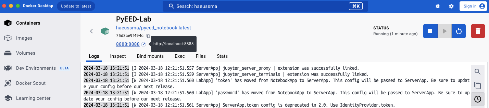

# Setting up JupyterLab

!!! info "What is JupyterLab?"
    JupyterLab is a web-based editor for writing and executing Jupyter Notebooks. Additionally, it allows you to see the file system, terminal, and other tools in the same window.

## Initial Setup

1. Install [Docker]
  [Docker]: docker.md

2. Open the Docker Desktop application search for `haeussma/pyeed-notebook` in the upper search bar and click on `Pull`.

    {{: style="height:400px"}}
    
3. Navigate to the `Images` section in the Docker Desktop application and click on :material-play: next to the `haeussma/pyeed-notebook` image.
    A `Run a new container` window pops up. Click on `Optional settings` to configure the container with the following settings:

    `Container name`
    :   Container name: `PyEED-Lab`

    `Ports`
    :    Host port: `8888`

    `Volumes` 
    !!! info inline end "Why specify a volume?"
        The volume is used to define what directory of your local machine is visible to the container. Without this configuration, the container would not be able to access your local files. It is advised to make the directory in which you store your data for analysis.

    :   Host path: `{SELECT YOUR WORKING DIRECTORY}`       
    :    Container path: `/home/jovyan/work`

    ??? example "Example"
        {: style="height:400px"}

    Then, click on `Run`. The initial configuration process for the container might take a few seconds up to five minutes.

5. Click on the link `8888:8888` in the header of the container. This will open a new tab in your browser, showing the JupyterLab environment.
    
    

7. 🎉 You are now in the JupyterLab environment. Your local files can be accessed via the `work` folder.

## Stopping the Container

To start the container, navigate to the `Containers` section in the Docker Desktop application and click on the :material-stop: button next to the `PyEED-Lab` container. Running containers are symbolized by a green container icon. You can close the browser window whenever you want. The container will keep running in the background unless you stop it in the Docker Desktop app.

## Restarting the Container

To start the container, navigate to the `Containers` section in the Docker Desktop application and click on the :material-play: button next to the `PyEED-Lab` container. Then click on the blue port number `8888:8888` next to the start button.