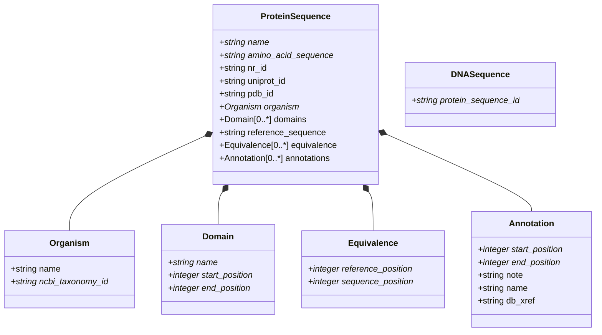

```mermaid
classDiagram
    ProteinSequence *-- Organism
    ProteinSequence *-- Domain
    ProteinSequence *-- Equivalence
    ProteinSequence *-- Annotation
    
    class ProteinSequence {
        +string name*
        +string amino_acid_sequence*
        +string nr_id
        +string uniprot_id
        +string pdb_id
        +Organism organism*
        +Domain[0..*] domains
        +string reference_sequence
        +Equivalence[0..*] equivalence
        +Annotation[0..*] annotations
    }
    
    class Organism {
        +string name
        +string ncbi_taxonomy_id*
    }
    
    class Domain {
        +string name*
        +integer start_position*
        +integer end_position*
    }
    
    class Equivalence {
        +integer reference_position*
        +integer sequence_position*
    }
    
    class Annotation {
        +integer start_position*
        +integer end_position*
        +string note
        +string name
        +string db_xref
    }
    
    class DNASequence {
        +string protein_sequence_id*
    }
    
```