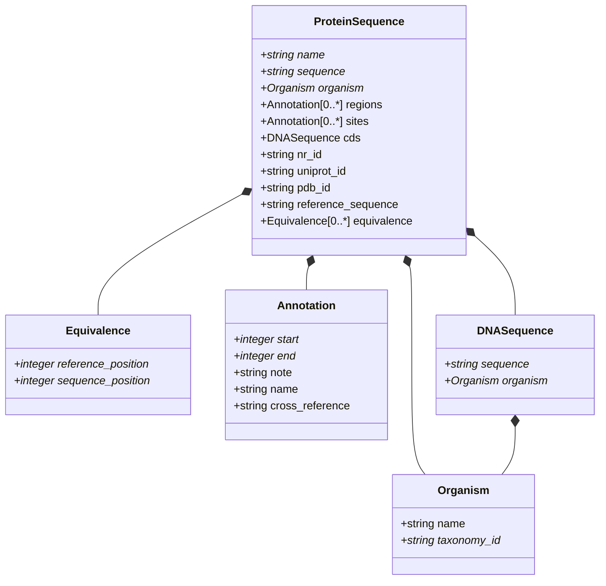

```mermaid
classDiagram
    ProteinSequence *-- Organism
    ProteinSequence *-- Equivalence
    ProteinSequence *-- Annotation
    ProteinSequence *-- DNASequence
    DNASequence *-- Organism
    
    class ProteinSequence {
        +string name*
        +string sequence*
        +Organism organism*
        +Annotation[0..*] regions
        +Annotation[0..*] sites
        +DNASequence cds
        +string nr_id
        +string uniprot_id
        +string pdb_id
        +string reference_sequence
        +Equivalence[0..*] equivalence
    }
    
    class Organism {
        +string name
        +string taxonomy_id*
    }
    
    class Equivalence {
        +integer reference_position*
        +integer sequence_position*
    }
    
    class Annotation {
        +integer start*
        +integer end*
        +string note
        +string name
        +string cross_reference
    }
    
    class DNASequence {
        +string sequence*
        +Organism organism*
    }
    
```