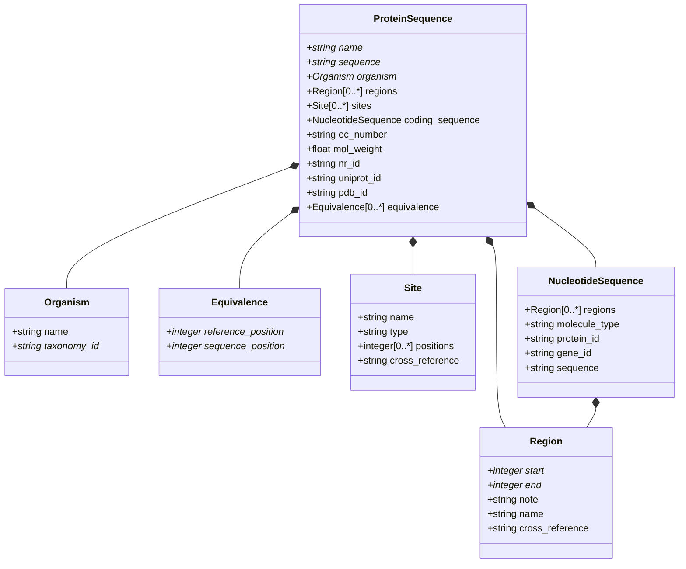

```mermaid
classDiagram
    ProteinSequence *-- Organism
    ProteinSequence *-- Equivalence
    ProteinSequence *-- Region
    ProteinSequence *-- Site
    ProteinSequence *-- NucleotideSequence
    NucleotideSequence *-- Region
    
    class ProteinSequence {
        +string name*
        +string sequence*
        +Organism organism*
        +Region[0..*] regions
        +Site[0..*] sites
        +NucleotideSequence coding_sequence
        +string ec_number
        +float mol_weight
        +string nr_id
        +string uniprot_id
        +string pdb_id
        +Equivalence[0..*] equivalence
    }
    
    class Organism {
        +string name
        +string taxonomy_id*
    }
    
    class Equivalence {
        +integer reference_position*
        +integer sequence_position*
    }
    
    class Region {
        +integer start*
        +integer end*
        +string note
        +string name
        +string cross_reference
    }
    
    class Site {
        +string name
        +string type
        +integer[0..*] positions
        +string cross_reference
    }
    
    class NucleotideSequence {
        +Region[0..*] regions
        +string molecule_type
        +string protein_id
        +string gene_id
        +string sequence
    }
    
```