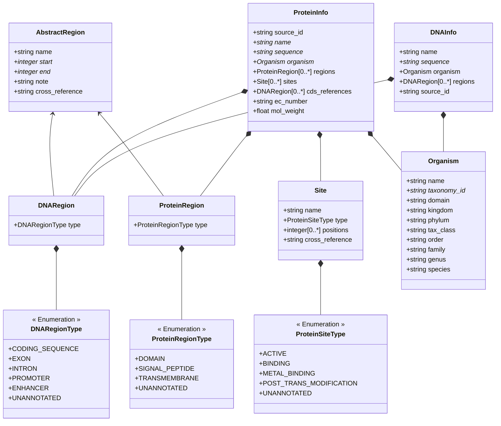

```mermaid
classDiagram
    AbstractRegion <-- DNARegion
    AbstractRegion <-- ProteinRegion
    ProteinInfo *-- DNARegion
    ProteinInfo *-- ProteinRegion
    ProteinInfo *-- Site
    ProteinInfo *-- Organism
    DNAInfo *-- DNARegion
    DNAInfo *-- Organism
    DNARegion *-- DNARegionType
    ProteinRegion *-- ProteinRegionType
    Site *-- ProteinSiteType
    
    class ProteinInfo {
        +string source_id
        +string name*
        +string sequence*
        +Organism organism*
        +ProteinRegion[0..*] regions
        +Site[0..*] sites
        +DNARegion[0..*] cds_references
        +string ec_number
        +float mol_weight
    }
    
    class DNAInfo {
        +string name
        +string sequence*
        +Organism organism
        +DNARegion[0..*] regions
        +string source_id
    }
    
    class AbstractRegion {
        +string name
        +integer start*
        +integer end*
        +string note
        +string cross_reference
    }
    
    class DNARegion {
        +DNARegionType type
    }
    
    class ProteinRegion {
        +ProteinRegionType type
    }
    
    class Site {
        +string name
        +ProteinSiteType type
        +integer[0..*] positions
        +string cross_reference
    }
    
    class Organism {
        +string name
        +string taxonomy_id*
        +string domain
        +string kingdom
        +string phylum
        +string tax_class
        +string order
        +string family
        +string genus
        +string species
    }
    
    class ProteinSiteType {
        << Enumeration >>
        +ACTIVE
        +BINDING
        +METAL_BINDING
        +POST_TRANS_MODIFICATION
        +UNANNOTATED
    }
    
    class DNARegionType {
        << Enumeration >>
        +CODING_SEQUENCE
        +EXON
        +INTRON
        +PROMOTER
        +ENHANCER
        +UNANNOTATED
    }
    
    class ProteinRegionType {
        << Enumeration >>
        +DOMAIN
        +SIGNAL_PEPTIDE
        +TRANSMEMBRANE
        +UNANNOTATED
    }
    
```