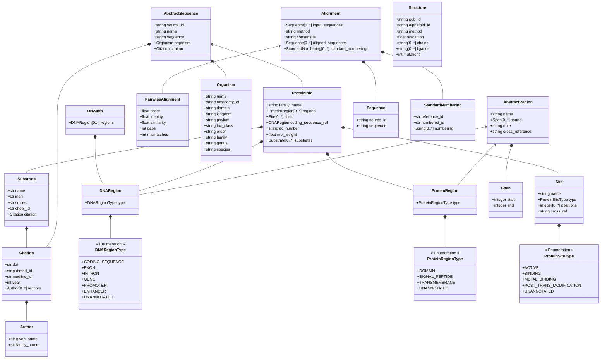

```mermaid
classDiagram
    AbstractSequence <-- ProteinInfo
    AbstractRegion <-- DNARegion
    AbstractRegion <-- ProteinRegion
    Alignment <-- PairwiseAlignment
    AbstractSequence *-- Citation
    AbstractSequence *-- Organism
    ProteinInfo *-- Substrate
    ProteinInfo *-- DNARegion
    ProteinInfo *-- ProteinRegion
    ProteinInfo *-- Site
    DNAInfo *-- DNARegion
    Citation *-- Author
    Substrate *-- Citation
    AbstractRegion *-- Span
    DNARegion *-- DNARegionType
    ProteinRegion *-- ProteinRegionType
    Site *-- ProteinSiteType
    Alignment *-- Sequence
    Alignment *-- StandardNumbering
    
    class AbstractSequence {
        +string source_id
        +string name
        +string sequence*
        +Organism organism
        +Citation citation
    }
    
    class ProteinInfo {
        +string family_name
        +ProteinRegion[0..*] regions
        +Site[0..*] sites
        +DNARegion coding_sequence_ref
        +string ec_number
        +float mol_weight
        +Substrate[0..*] substrates
    }
    
    class Structure {
        +string pdb_id
        +string alphafold_id
        +string method
        +float resolution
        +string[0..*] chains
        +string[0..*] ligands
        +int mutations
    }
    
    class DNAInfo {
        +DNARegion[0..*] regions
    }
    
    class Citation {
        +str doi
        +str pubmed_id
        +str medline_id
        +int year
        +Author[0..*] authors
    }
    
    class Author {
        +str given_name
        +str family_name
    }
    
    class Substrate {
        +str name
        +str inchi
        +str smiles
        +str chebi_id
        +Citation citation
    }
    
    class AbstractRegion {
        +string name
        +Span[0..*] spans
        +string note
        +string cross_reference
    }
    
    class DNARegion {
        +DNARegionType type
    }
    
    class ProteinRegion {
        +ProteinRegionType type
    }
    
    class Span {
        +integer start
        +integer end
    }
    
    class Site {
        +string name
        +ProteinSiteType type
        +integer[0..*] positions
        +string cross_ref
    }
    
    class Organism {
        +string name
        +string taxonomy_id*
        +string domain
        +string kingdom
        +string phylum
        +string tax_class
        +string order
        +string family
        +string genus
        +string species
    }
    
    class Alignment {
        +Sequence[0..*] input_sequences
        +string method
        +string consensus
        +Sequence[0..*] aligned_sequences
        +StandardNumbering[0..*] standard_numberings
    }
    
    class PairwiseAlignment {
        +float score
        +float identity
        +float similarity
        +int gaps
        +int mismatches
    }
    
    class Sequence {
        +string source_id
        +string sequence
    }
    
    class StandardNumbering {
        +str reference_id
        +str numbered_id
        +string[0..*] numbering
    }
    
    class ProteinSiteType {
        << Enumeration >>
        +ACTIVE
        +BINDING
        +METAL_BINDING
        +POST_TRANS_MODIFICATION
        +UNANNOTATED
    }
    
    class DNARegionType {
        << Enumeration >>
        +CODING_SEQUENCE
        +EXON
        +INTRON
        +GENE
        +PROMOTER
        +ENHANCER
        +UNANNOTATED
    }
    
    class ProteinRegionType {
        << Enumeration >>
        +DOMAIN
        +SIGNAL_PEPTIDE
        +TRANSMEMBRANE
        +UNANNOTATED
    }
    
```