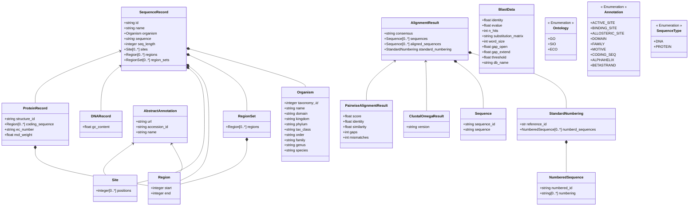

```mermaid
classDiagram
    SequenceRecord <-- ProteinRecord
    SequenceRecord <-- DNARecord
    AbstractAnnotation <-- Site
    AbstractAnnotation <-- Region
    AlignmentResult <-- PairwiseAlignmentResult
    AlignmentResult <-- ClustalOmegaResult
    SequenceRecord *-- Site
    SequenceRecord *-- Region
    SequenceRecord *-- RegionSet
    SequenceRecord *-- Organism
    ProteinRecord *-- Region
    RegionSet *-- Region
    AlignmentResult *-- Sequence
    AlignmentResult *-- StandardNumbering
    StandardNumbering *-- NumberedSequence
    
    class SequenceRecord {
        +string id
        +string name
        +Organism organism
        +string sequence*
        +integer seq_length
        +Site[0..*] sites
        +Region[0..*] regions
        +RegionSet[0..*] region_sets
    }
    
    class ProteinRecord {
        +string structure_id
        +Region[0..*] coding_sequence
        +string ec_number
        +float mol_weight
    }
    
    class DNARecord {
        +float gc_content
    }
    
    class AbstractAnnotation {
        +string url
        +string accession_id
        +string name
    }
    
    class Site {
        +integer[0..*] positions
    }
    
    class Region {
        +integer start
        +integer end
    }
    
    class RegionSet {
        +Region[0..*] regions
    }
    
    class Organism {
        +integer taxonomy_id*
        +string name
        +string domain
        +string kingdom
        +string phylum
        +string tax_class
        +string order
        +string family
        +string genus
        +string species
    }
    
    class BlastData {
        +float identity
        +float evalue
        +int n_hits
        +string substitution_matrix
        +int word_size
        +float gap_open
        +float gap_extend
        +float threshold
        +string db_name
    }
    
    class Sequence {
        +string sequence_id
        +string sequence
    }
    
    class AlignmentResult {
        +string consensus
        +Sequence[0..*] sequences
        +Sequence[0..*] aligned_sequences
        +StandardNumbering standard_numbering
    }
    
    class PairwiseAlignmentResult {
        +float score
        +float identity
        +float similarity
        +int gaps
        +int mismatches
    }
    
    class StandardNumbering {
        +str reference_id
        +NumberedSequence[0..*] numberd_sequences
    }
    
    class NumberedSequence {
        +string numbered_id
        +string[0..*] numbering
    }
    
    class ClustalOmegaResult {
        +string version
    }
    
    class Ontology {
        << Enumeration >>
        +GO
        +SIO
        +ECO
    }
    
    class Annotation {
        << Enumeration >>
        +ACTIVE_SITE
        +BINDING_SITE
        +ALLOSTERIC_SITE
        +DOMAIN
        +FAMILY
        +MOTIVE
        +CODING_SEQ
        +ALPHAHELIX
        +BETASTRAND
    }
    
    class SequenceType {
        << Enumeration >>
        +DNA
        +PROTEIN
    }
    
```