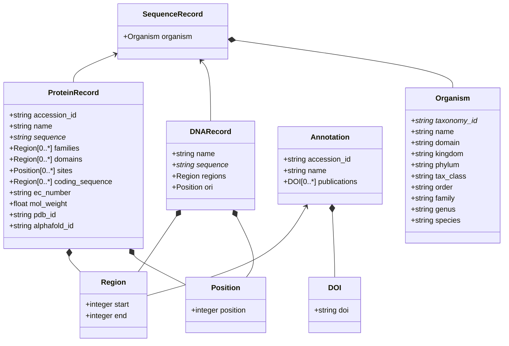

```mermaid
classDiagram
    SequenceRecord <-- ProteinRecord
    SequenceRecord <-- DNARecord
    Annotation <-- Region
    SequenceRecord *-- Organism
    ProteinRecord *-- Region
    ProteinRecord *-- Position
    DNARecord *-- Region
    DNARecord *-- Position
    Annotation *-- DOI
    
    class SequenceRecord {
        +Organism organism
    }
    
    class ProteinRecord {
        +string accession_id
        +string name
        +string sequence*
        +Region[0..*] families
        +Region[0..*] domains
        +Position[0..*] sites
        +Region[0..*] coding_sequence
        +string ec_number
        +float mol_weight
        +string pdb_id
        +string alphafold_id
    }
    
    class DNARecord {
        +string name
        +string sequence*
        +Region regions
        +Position ori
    }
    
    class Annotation {
        +string accession_id
        +string name
        +DOI[0..*] publications
    }
    
    class DOI {
        +string doi
    }
    
    class Region {
        +integer start
        +integer end
    }
    
    class Position {
        +integer position
    }
    
    class Organism {
        +string taxonomy_id*
        +string name
        +string domain
        +string kingdom
        +string phylum
        +string tax_class
        +string order
        +string family
        +string genus
        +string species
    }
    
```