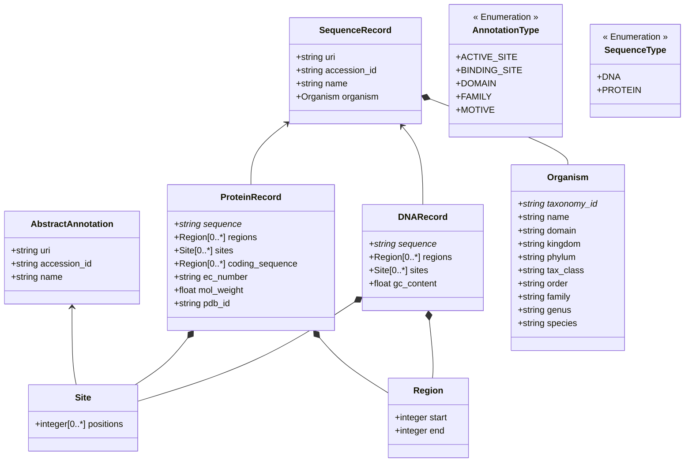

```mermaid
classDiagram
    SequenceRecord <-- ProteinRecord
    SequenceRecord <-- DNARecord
    AbstractAnnotation <-- Site
    SequenceRecord *-- Organism
    ProteinRecord *-- Site
    ProteinRecord *-- Region
    DNARecord *-- Site
    DNARecord *-- Region
    
    class SequenceRecord {
        +string uri
        +string accession_id
        +string name
        +Organism organism
    }
    
    class ProteinRecord {
        +string sequence*
        +Region[0..*] regions
        +Site[0..*] sites
        +Region[0..*] coding_sequence
        +string ec_number
        +float mol_weight
        +string pdb_id
    }
    
    class DNARecord {
        +string sequence*
        +Region[0..*] regions
        +Site[0..*] sites
        +float gc_content
    }
    
    class AbstractAnnotation {
        +string uri
        +string accession_id
        +string name
    }
    
    class Site {
        +integer[0..*] positions
    }
    
    class Region {
        +integer start
        +integer end
    }
    
    class Organism {
        +string taxonomy_id*
        +string name
        +string domain
        +string kingdom
        +string phylum
        +string tax_class
        +string order
        +string family
        +string genus
        +string species
    }
    
    class AnnotationType {
        << Enumeration >>
        +ACTIVE_SITE
        +BINDING_SITE
        +DOMAIN
        +FAMILY
        +MOTIVE
    }
    
    class SequenceType {
        << Enumeration >>
        +DNA
        +PROTEIN
    }
    
```