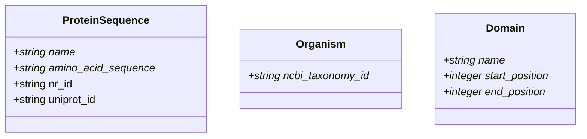

```mermaid
classDiagram
    
    class ProteinSequence {
        +string name*
        +string amino_acid_sequence*
        +string nr_id
        +string uniprot_id
    }
    
    class Organism {
        +string ncbi_taxonomy_id*
    }
    
    class Domain {
        +string name*
        +integer start_position*
        +integer end_position*
    }
    
```